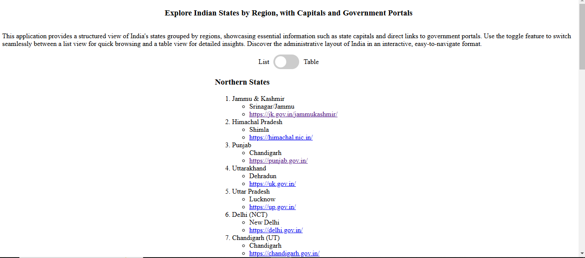
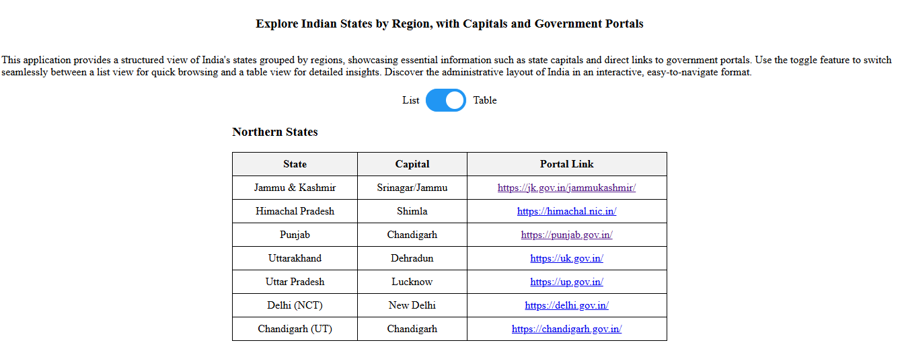

# Interactive State Information Explorer

An interactive application that provides details about Indian states categorized by regions. Users can view state names, capitals, and portal links in both list and table formats. Toggle between list and table view using the checkbox for an enriched user experience.

## Table of Contents

- [Overview](#overview)
- [Features](#features)
- [Screenshots](#screenshots)
- [Usage Instructions](#usage-instructions)
- [Code Structure](#code-structure)
- [Notes](#notes)
- [Hosting on GitHub Pages](#hosting-on-gitHub-pages)

## Overview

The application displays organized information about states in India, including state names, capitals, and government portals. Users can explore data in a list or table format for easier navigation and comparison. This project serves as an educational tool, helping beginners learn about basic HTML, JavaScript, and jQuery functionalities through an interactive example.

## Features

- View information about states grouped by region.
- Toggle between a list view and a table view.
- Clickable links to state government portals.
- Easy-to-navigate interface with organized data.

## Screenshots

### List View


### Table View


## Usage Instructions

1. Clone or download the project files.
2. Open `index.html` in a web browser.
3. Toggle between list and table views using the checkbox provided at the top of the page.

## Code Structure

- **index.html**: Main HTML file containing the structure and layout of the app.
- **style.css**: Styles for layout and design.
- **app.js**: JavaScript code that handles data rendering and view toggling.

## Data

This app uses a JavaScript object to store state information for each region, with arrays containing state names, capitals, and portal links.

```javascript
const stateData = [
    {
        region: 'Northern States',
        states: ['Jammu & Kashmir', 'Himachal Pradesh', 'Punjab', 'Uttarakhand', 'Uttar Pradesh', 'Delhi (NCT)', 'Chandigarh (UT)'],
        capitals: ['Srinagar/Jammu', 'Shimla', 'Chandigarh', 'Dehradun', 'Lucknow', 'New Delhi', 'Chandigarh'],
        portals: ['https://jk.gov.in/jammukashmir/', 'https://himachal.nic.in/', 'https://punjab.gov.in/', 'https://uk.gov.in/', 'https://up.gov.in/',
            'https://delhi.gov.in/', 'https://chandigarh.gov.in/']
    },
    // Other regions data ...
];
```

## Notes:

- Update the screenshot file paths like `./screenshots/list-view.png` and `./screenshots/table-view.png` based on your actual folder structure.
- The **Data** section code snippet includes only the first region. Feel free to add the rest if needed.

## Hosting on GitHub Pages
This project is hosted on GitHub Pages and can be accessed at: [URL](https://ujjwalgarai.github.io/html-intermediate-tutorial/) 

